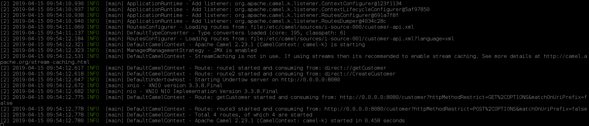

# CamelK-customerAPI

# How to Run

```sh
git clone https://github.com/abouchama/CamelK-customerAPI.git
cd CamelK-customerAPI
kamel run --dev --name customers --dependency camel-undertow --property camel.rest.port=8080 --open-api customer-api.json customer-api.xml
```



# In order to print rest routes

You have to enable DEBUG logging level:

```sh
kamel run --dev --name customers --dependency camel-undertow --property camel.rest.port=8080 --open-api customer-api.json --logging-level org.apache.camel.k=DEBUG customer-api.xml
```
