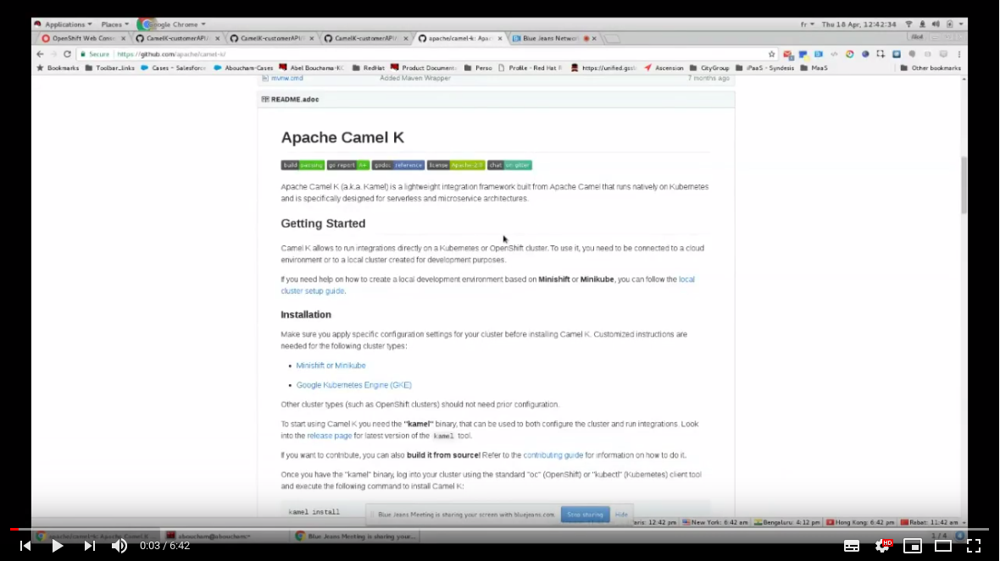

# CamelK-customerAPI

Camel K lets you build and deploy your API on Kubernetes or Red Hat OpenShift in less than a second. 

### Run on Minishift
```sh
oc login -u system:admin
kamel install --cluster-setup

oc login -u developer -p x
oc new-project demo
kamel install

kamel run customer-api.xml \
    --open-api customer-api.json \
    --name customers \
    --dependency camel-undertow \
    --dependency camel-rest \
    -t quarkus.enabled=true \
    --logging-level org.apache.camel.k=DEBUG \
    --property camel.rest.port=8080 \
    --env CAMEL_LOG_MSG=" ** Camelk ** This request is handled by this POD: {{env:HOSTNAME}}" \
    --env CAMEL_GET_SETBODY=" (V1) --> Enjoy the camelk Knative demo :-) | POD : {{env:HOSTNAME}} \n" \
    --env CAMEL_CREATE_SETBODY=" (V1) --> Enjoy the camelk Knative demo :-) | POD : {{env:HOSTNAME}} \n"

curl http://customers-demo.$(minishift ip).nip.io/camel/customer
```

### Read the tutorial at: 

https://developers.redhat.com/blog/2019/04/25/build-and-deploy-an-api-with-camel-k-on-red-hat-openshift/

### Learn how in this video:

[](http://www.youtube.com/watch?v=WE8K6872w1U "How to build and deploy an API with Camel K on OpenShift")
